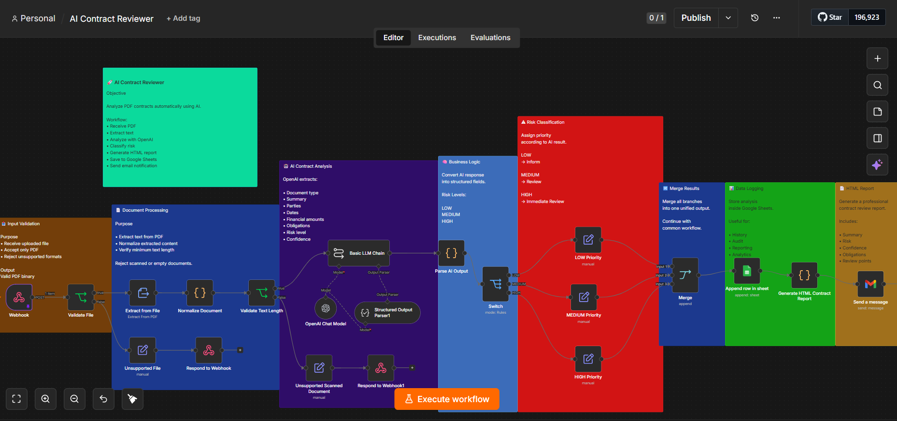

# AI Contract Reviewer


AI Contract Reviewer is an n8n workflow that receives a text-based PDF contract, extracts its content, analyzes it with an OpenAI model, classifies its risk level, logs the result in Google Sheets, generates an HTML report, and sends the report by email.

> **Important:** This project is a portfolio demonstration and does not provide legal advice. AI-generated results must be reviewed by a qualified person before any legal or business decision.

## Features

- PDF upload through an n8n webhook
- File type and minimum-text validation
- Structured AI extraction: parties, dates, amounts, obligations, and review points
- Risk classification: `LOW`, `MEDIUM`, or `HIGH`
- Priority and human-review routing
- Google Sheets audit log
- HTML report generation
- Gmail notification
- Error responses for unsupported or scanned documents

## Workflow architecture



```text
Webhook -> Validate PDF -> Extract text -> Validate text
        -> OpenAI analysis -> Parse structured output -> Risk switch
        -> Merge -> Google Sheets -> HTML report -> Gmail
```

## Repository structure

```text
AI-Contract-Reviewer/
|-- assets/
|-- sample-data/
|   |-- 01-low-risk-contract.pdf
|   |-- 02-medium-risk-contract.pdf
|   |-- 03-high-risk-contract.pdf
|   |-- 04-invalid-file.txt
|   |-- expected-results.json
|   `-- google-sheets-template.csv
|-- workflow/
|   `-- ai-contract-reviewer.public.json
|-- .gitignore
|-- LICENSE
`-- README.md
```

## Requirements

- An n8n instance with the LangChain nodes used by this workflow
- OpenAI API credentials configured in n8n
- Google Sheets OAuth2 credentials configured in n8n
- Gmail OAuth2 credentials configured in n8n
- A Google Sheet created from `sample-data/google-sheets-template.csv`

## Installation

1. Download or clone this repository.
2. In n8n, select **Import from File**.
3. Import `workflow/ai-contract-reviewer.public.json`.
4. Open **OpenAI Chat Model** and select your OpenAI credential.
5. Open **Append row in sheet**, select your Google Sheets credential, document, and sheet.
6. Open **Send a message**, select your Gmail credential and replace `YOUR_EMAIL@example.com` with your destination address.
7. Save the workflow, publish it, and copy its production webhook URL.

No credential, personal URL, execution data, Google Sheet ID, or email address is included in the public workflow.

## Google Sheets columns

Import `sample-data/google-sheets-template.csv` or create a sheet with these exact headers:

`analysis_id`, `file_name`, `document_type`, `summary`, `parties`, `effective_date`, `termination_date`, `amounts`, `obligations`, `points_to_verify`, `risk_level`, `confidence`, `priority`, `review_required`, `processed_at`, `status`

## Testing

The webhook expects a `multipart/form-data` request with the PDF stored in the binary field named `file`.

```bash
curl -X POST "https://YOUR_N8N_DOMAIN/webhook/contract-review" \
  -F "file=@sample-data/02-medium-risk-contract.pdf;type=application/pdf"
```

Run all four cases in `sample-data/`. The AI wording and confidence may vary, so validate the risk category and extracted facts rather than expecting an identical sentence. Expected behavior is documented in `sample-data/expected-results.json`.

| Test | Expected behavior |
| --- | --- |
| Low-risk PDF | `LOW`, normal priority, no mandatory review |
| Medium-risk PDF | `MEDIUM`, review priority, human review required |
| High-risk PDF | `HIGH`, critical priority, immediate human review |
| Text file | HTTP `400`, `UNSUPPORTED_FILE` |

Scanned image-only PDFs are not supported in this version and should return HTTP `422`.

## Public workflow notes

The JSON in this repository is safe to share, but it still requires each user to configure their own credentials and resource selections after import. Never commit exported credentials, `.env` files, execution data, real contracts, client information, or private webhook URLs.

## Possible improvements

- OCR support for scanned PDFs
- Contract-specific risk rules and jurisdiction profiles
- Human approval before sending reports
- Error workflow, retries, and alerting
- Encrypted document storage and retention policies
- Automated regression evaluation for AI outputs

## License

Released under the [MIT License](LICENSE).
